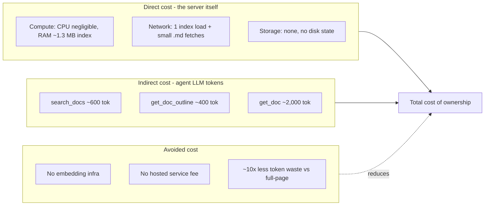

# Cost analysis: mcp-doc-server

How much does it cost to run mcp-doc-server, and how does that compare to other ways
of giving an AI agent access to documentation? This note answers four questions:

1. Adoption: is mcp-doc-server cheaper than the alternatives?
2. Running cost: what does it cost per developer, team, or month to operate?
3. Comparison: how do the major doc-retrieval approaches stack up?
4. Budget at scale: what does the bill look like across a team or org?

The short answer: mcp-doc-server adds zero server-side inference cost (it runs no LLM and
no embeddings), so the only meaningful cost is the agent's own LLM tokens for the
documentation content it pulls into context. Because retrieval is bounded
(outline-then-slice), that token cost is roughly an order of magnitude lower than dumping
whole pages into the context window.

---

## Sources and methodology

Every number in this document is tagged as one of three kinds:

- Measured or committed: comes from this repository's specs, benchmarks, or code. These
  are the project's own decided targets, not guesses.
- Verified external: third-party pricing, verified as of June 2026. Subject to change by
  the vendor.
- Modeled: an estimate built from stated assumptions. Not a measured benchmark of any
  specific product. Every modeled figure lists the assumptions behind it.

### Measured or committed (from this repo)

| Figure | Value | Source |
|--------|-------|--------|
| Server-side inference cost | 0 | Invariant I2 in [SPECS.md](../../../SPECS.md) |
| `search_docs` response budget | <= ~600 tokens | [BENCHMARKS.md](../../../BENCHMARKS.md) |
| `get_doc_outline` budget | <= ~400 tokens | [BENCHMARKS.md](../../../BENCHMARKS.md) |
| `get_doc` default slice | <= ~2,000 tokens (80 lines) | [BENCHMARKS.md](../../../BENCHMARKS.md), invariant I4 |
| Index size | ~1.3 MB, ~6,879 entries | [BENCHMARKS.md](../../../BENCHMARKS.md) |
| Index parse time | < 250 ms (one-time) | [BENCHMARKS.md](../../../BENCHMARKS.md) |
| `search_docs` latency | < 10 ms (in-memory) | [BENCHMARKS.md](../../../BENCHMARKS.md) |
| Rate limits | 5 concurrent, 200 ms gap | Invariant I9, [configure.md](../../sources/configure.md) |
| Body caps | 2 MiB doc, 10 MiB index | Invariant I10 |
| Token reduction vs full page | ~10x | [demo/scenarios/02-token-efficient-retrieval.md](../demo/scenarios/02-token-efficient-retrieval.md) |

### Verified external (June 2026 pricing, per 1M tokens)

| Model / mode | Input | Output | Cache read |
|--------------|-------|--------|------------|
| Claude Haiku 4.5 | $1.00 | $5.00 | $0.10 |
| Claude Sonnet 4.6 | $3.00 | $15.00 | $0.30 |
| Claude Opus 4.8 | $5.00 | $25.00 | $0.50 |
| Cursor Auto mode | $1.25 | $6.00 | $0.25 |

Subscription anchors: Cursor Pro is $20/month (includes ~$20 of model usage); Pro+ is
$60/month (~$70 of usage). These rates change, so re-verify before quoting externally.

### Modeled (estimates with stated assumptions)

The per-query token counts for alternative approaches (full-page fetch, embedding RAG,
hosted doc MCP) are modeled, not measured against any specific product. Assumptions are
stated inline at each table. There is no public, apples-to-apples benchmark for these
categories, so treat them as directional.

Two things are not modeled and would need real telemetry to pin down:

- Queries per developer per day. This repo has no usage telemetry. The scale tables below
  use three illustrative tiers (light 5/day, moderate 20/day, heavy 50/day) and let you
  pick.
- Infrastructure cost of a self-hosted embedding RAG pipeline. Quoted as a qualitative
  range ($$$), since it depends entirely on the vector DB, embedding model, and host.

---

## 1. The cost model

mcp-doc-server has three cost layers. Only one of them is non-trivial.



### Direct cost: effectively zero

mcp-doc-server is a local Go binary with a stdlib-only core (no cloud SDKs, no AI
libraries). It does the following:

- Runs no server-side LLM or embeddings (invariant I2, measured/committed).
- Loads a ~1.3 MB index once into memory (~6,879 entries, measured).
- Fetches small Markdown pages on demand from public `grafana.com/docs/` URLs.
- Keeps no disk state, no database, no vector store.

The compute footprint is negligible: a sub-250 ms index parse at startup, sub-10 ms
in-memory search, and bounded per-fetch CPU for Markdown cleanup. Network is one index
download plus a handful of small page fetches per agent session, self-rate-limited to 5
concurrent requests with a 200 ms gap (invariant I9). There is no metered API and no
egress fee against public docs.

Direct cost per query is about $0. The only consumption is the developer's existing
machine (or wherever the agent runs) and ordinary HTTPS bandwidth.

### Indirect cost: the agent's LLM tokens

The meaningful cost is what the agent's model charges to read the documentation that
mcp-doc-server returns. Bounded retrieval keeps that token count small.

A typical retrieval workflow is three steps:

| Step | Tokens into the agent's context | Source |
|------|-------------------------------|--------|
| `search_docs` (5 results) | ~600 | BENCHMARKS.md (measured) |
| `get_doc_outline` | ~400 | BENCHMARKS.md (measured) |
| `get_doc` (one section) | ~2,000 | BENCHMARKS.md (measured) |
| Workflow total | ~3,000 | sum |

These are the tool output budgets: the content that lands in the agent's context as input
tokens on the next turn. They are committed targets in BENCHMARKS.md, not guesses.

### Avoided cost: what you don't pay for

- No embedding infrastructure. Search is deterministic TF-IDF over the in-memory index
  (search ranking section, SPECS.md). No vector database, no embedding model bill, no
  indexing pipeline to run and maintain.
- No hosted-service fee. The server is the local binary, so there is no per-seat or
  per-call charge for the retrieval layer itself.
- About 10x less token waste. Bounded slices replace full pages. The
  token-efficient-retrieval scenario shows ~300 tokens for a targeted fetch versus ~3,000
  for the full page on a single example. The answer quality is the same at a fraction of
  the context cost.

---

## 2. Per-workflow token math

Cost per workflow = (input tokens / 1,000,000) x input rate. Documentation content is
input to the agent (it reads it), so the input rate dominates. The agent's reasoning and
answer are output tokens, but those are unchanged by which retrieval approach you use, so
we hold them out of the comparison and focus on the retrieval-driven input cost.

### One workflow (~3,000 input tokens)

| Model | Input rate /1M | Cost per workflow |
|-------|---------------|-------------------|
| Haiku 4.5 | $1.00 | $0.0030 |
| Cursor Auto | $1.25 | $0.0038 |
| Sonnet 4.6 | $3.00 | $0.0090 |
| Opus 4.8 | $5.00 | $0.0150 |

In agent token terms, a full mcp-doc-server retrieval workflow costs less than a cent on
the cheaper models and under two cents on the most expensive.

### The same answer without bounded retrieval

If the agent instead pulls a whole page into context (a large config reference can be
~30,000 tokens, derived from the ~10x reduction example, modeled from the scenario):

| Model | Bounded (~3K tok) | Full page (~30K tok) | Extra cost per query |
|-------|-------------------|----------------------|----------------------|
| Haiku 4.5 | $0.0030 | $0.0300 | +$0.027 |
| Sonnet 4.6 | $0.0090 | $0.0900 | +$0.081 |
| Opus 4.8 | $0.0150 | $0.1500 | +$0.135 |

The savings look small per query but compound fast (see the scale tables). The bigger
practical effect is that bounded retrieval leaves the context window free for the actual
task instead of filling it with documentation chrome.

---

## 3. Scale projections

Monthly cost = workflows/day x developers x 22 working days x cost-per-workflow.
Assumes the full three-step workflow (~3,000 input tokens) on Sonnet 4.6 ($3/1M input).
Queries/day is illustrative (no telemetry). Pick the row that matches your team.

| Usage tier | Queries/dev/day | 1 dev | 10 devs | 50 devs | 200 devs |
|------------|----------------|-------|---------|---------|----------|
| Light | 5 | $0.99 | $9.90 | $49.50 | $198.00 |
| Moderate | 20 | $3.96 | $39.60 | $198.00 | $792.00 |
| Heavy | 50 | $9.90 | $99.00 | $495.00 | $1,980.00 |

Even at 200 heavy users running 50 doc workflows each every working day, the
documentation-retrieval portion of the agent bill is under $2,000/month on a premium
model. On Haiku or Cursor Auto it is roughly a third of that.

For contrast, the same 200-heavy-user scenario without bounded retrieval (full-page
fetches, ~30,000 tokens each, modeled) would be about $19,800/month. That is a
~$17,800/month difference attributable purely to bounded retrieval, a ~10x swing.

### What this does not include

This is the cost of the documentation-retrieval slice only. It is not the total agent
bill. Coding agents spend most of their tokens on the task itself: reading the codebase,
reasoning, and writing diffs. mcp-doc-server's contribution to that bill is the small,
bounded numbers above.

---

## 4. Approach comparison

How mcp-doc-server's pattern compares to other ways of giving an agent documentation
access. Approaches are described as architectural categories, not specific products.

Token and cost figures for the non-mcp-doc-server columns are modeled, with the
assumptions stated below the table.

| Dimension | mcp-doc-server | Full-page fetch | Embedding RAG (self-hosted) | Hosted doc MCP | Training data only |
|-----------|---------------|-----------------|-----------------------------|----------------|--------------------|
| Server / infra cost | $0 (local binary) | $0 | $$$ (vector DB + embed pipeline) | Vendor-priced (unknown) | $0 |
| Added inference cost | $0 (no LLM/embeddings) | $0 | Embedding calls at index + query time | Possibly (vendor may run AI) | $0 |
| Tokens per query (input) | ~3,000 | ~30,000 | ~1,000-5,000 | ~2,000-5,000 | 0 |
| Cost per query (Sonnet 4.6 input) | ~$0.009 | ~$0.090 | ~$0.003-0.015 + embed cost | ~$0.006-0.015 + vendor fee | $0 |
| Answer accuracy | Current (live fetch) | Current (live fetch) | As fresh as last reindex | Current (vendor-maintained) | Stale (training cutoff) |
| Setup effort | Build binary + MCP config | None (agent fetches URLs) | Stand up vector DB + pipeline | One URL in config | None |
| Ongoing maintenance | None | None | Reindex pipeline, embedding model upkeep | None (vendor) | None |
| Determinism / reproducibility | High (TF-IDF, no randomness) | High | Lower (embedding drift on reindex) | Vendor-dependent | N/A |
| Data control | Full (local, public docs only) | Full | Full (self-hosted) | Lower (data leaves your network) | Full |

### Modeling assumptions

- Full-page fetch (~30,000 tok): the agent retrieves an entire large doc page into context.
  Derived from the ~10x reduction example in
  [demo/scenarios/02-token-efficient-retrieval.md](../demo/scenarios/02-token-efficient-retrieval.md).
  Real pages range widely: a small page is a few hundred tokens; a large config reference
  is tens of thousands.
- Embedding RAG (~1,000-5,000 tok): semantic search returns top-k chunks. Token count
  depends on chunk size and k. The cost line omits the embedding cost (both the one-time
  index embed and the per-query embedding of the user's question) and the vector DB hosting
  cost, which together are the "$$$" infra line. These are real costs that this category
  carries and mcp-doc-server does not.
- Hosted doc MCP (~2,000-5,000 tok): a remote service returns pages or sections, often with
  added enrichment. Per-call and per-seat pricing is vendor-specific and not publicly
  comparable, so the fee is marked unknown. Data leaves your network to a third party.
- Training data only (0 tok): the agent answers from its pretraining with no retrieval.
  Zero token cost, but no freshness guarantee. This is the failure mode mcp-doc-server
  exists to fix.

### Reading the comparison

- mcp-doc-server's distinctive position is $0 infra, $0 added inference, and bounded
  tokens. It is the only column with zeros across both server cost and added inference cost
  while still returning current content.
- Embedding RAG can return fewer tokens per query (tighter chunks) but pays for it with
  embedding-call cost and infrastructure that mcp-doc-server avoids entirely.
- Full-page fetch is the most expensive in token terms despite $0 infra. It is the opposite
  trade-off.
- Training-data-only is genuinely free but trades away the freshness that is the whole
  point.

---

## 5. ROI summary

For adoption decisions:

- Server cost is provably zero. No paid API, no cloud dependency, no embedding bill, no
  per-seat fee. Verifiable from `go.mod` (stdlib + MCP/cobra adapters only) and invariant
  I2.
- Token cost is bounded and small. A full retrieval workflow is ~3,000 input tokens: under
  a cent on cheaper models, under two cents on premium. The outline-then-slice design is
  the cheapest token profile of any approach that returns current content.
- No infrastructure to operate. Unlike a self-hosted embedding RAG, there is nothing to
  reindex, no vector DB to keep alive, no embedding model to budget for.

For running-cost estimates:

- At realistic team sizes, the documentation-retrieval portion of the agent bill runs from
  tens to low hundreds of dollars per month (moderate use, 10-50 devs: ~$40-$200). It only
  reaches ~$2,000/month at large-org scale (200 devs) with heavy daily use on a premium
  model. On Haiku or Cursor Auto it is about a third of that.

For budgeting at scale:

- Use the scale table in section 3, or the formula below, with your own queries/day and
  model assumptions:

  ```
  monthly cost = (workflow tokens / 1,000,000) x input rate x queries/dev/day x developers x working days
  ```

  For a bounded workflow that is `(3000 / 1,000,000) x rate x queries x devs x days`. The
  dominant levers are model choice (Haiku vs Opus is a 5x swing) and whether retrieval
  stays bounded (bounded vs full-page is a ~10x swing).

In summary, mcp-doc-server moves cost off the server (where it would be fixed
infrastructure) and onto the agent's token bill (where it is small and
usage-proportional), then minimizes that token bill through bounded retrieval. You pay only
for the documentation an agent actually reads, and only as much of each page as it needs.

---

## Caveats

- Pricing drifts. All external rates are June 2026 figures. Re-verify before quoting.
- Token budgets are committed targets, not live measurements. BENCHMARKS.md marks them
  provisional; confirm against representative pages (for example, a large Grafana config
  reference) if precision matters.
- Queries/day is illustrative. There is no usage telemetry in this repo; the scale tiers
  are planning placeholders, not observed data.
- Alternative-approach figures are modeled. They describe architectural categories under
  stated assumptions, not benchmarks of any specific product.
- Caching is not yet implemented. Repeated fetches of the same page re-download today (page
  caching is an open question in SPECS.md). A future TTL cache would cut network cost, and,
  if results were deduplicated within a session, some token cost. This analysis assumes the
  current no-cache behavior, so it is a conservative (upper-bound) token estimate for
  repeated lookups.
