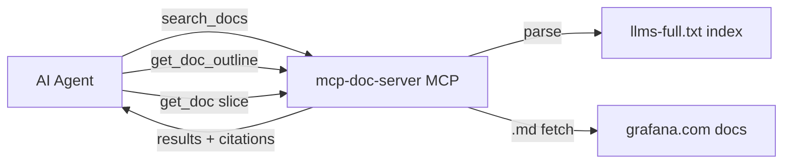

# Common use cases for a docs MCP server

A docs MCP server exposes a body of documentation to AI agents through standard tools
(`search_docs`, `get_doc`, `get_doc_outline`, `list_products`). This note captures the
recurring use-case patterns and how `mcp-doc-server` maps onto them.

## Use cases

### 1. Grounding answers in authoritative content (RAG without embeddings)
An agent answers a user question by retrieving the relevant doc page instead of relying on
stale or hallucinated training data. Especially valuable for fast-moving products where the
model's knowledge cutoff lags reality. Per `SPECS.md`, the server complements `mcp-grafana`
and `gcx`, which act on a live instance but expose no docs.

### 2. Version-aware / channel-aware lookups
"How do I configure X in version 11.2 vs latest?" The server resolves the correct doc
channel so the agent does not mix versions. (v1 is `latest`-only with a reserved-but-inert
`version` parameter — invariant I6.)

### 3. Citations and source traceability
Every answer can link back to the canonical doc URL, so users can verify and the agent is
not a black box. (Invariant I5.)

### 4. Token-efficient, bounded retrieval
Instead of dumping a whole page into context, the agent gets an outline
(`get_doc_outline`), picks a section, and fetches just that slice (`get_doc` bounded read).
This is the core efficiency play — invariants I4 (bounded responses) and I7 (lean search).

### 5. Product / namespace discovery
`list_products`-style tools let an agent first determine what documentation exists before
drilling in. Useful when a suite spans many products.

### 6. Deterministic, low-cost retrieval inside agentic workflows
A coding or ops agent mid-task ("set up alerting", "write a dashboard config") pulls exact
syntax or config keys on demand. Keeping retrieval deterministic with no server-side LLM or
embedding calls (invariant I2) makes it cheap and predictable.

### 7. Onboarding, troubleshooting, and "how do I" assistants
Chatbots or support copilots that answer setup, config, migration, and error-message
questions straight from the docs.

### 8. Keeping sensitive/internal indexing server-side
The full index stays on the server; only matched results reach the model (invariant I1).
This matters when the index itself is large or partly internal.

## Where mcp-doc-server fits

The design targets use cases 1-6 directly: lean search, outline-then-slice fetching,
citations, and a latest-only deterministic retrieval layer that pairs with the
live-instance MCP servers.
