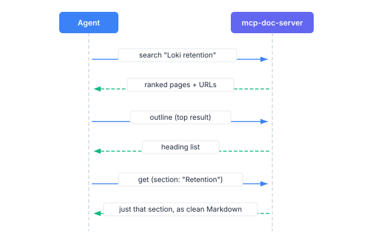

# Overview

Using Grafana Docs MCP Server, an AI agent can look up Grafana Labs documentation while it answers you, instead of guessing from training data. It's a [Model Context Protocol (MCP)](https://modelcontextprotocol.io) server: the agent calls tools during the conversation, then cites the `grafana.com/docs/` page it used.

It serves current published documentation only. Version-specific retrieval isn't available.

If you already use [gcx](https://github.com/grafana/gcx) or [mcp-grafana](https://github.com/grafana/mcp-grafana), you don't need this server. Those projects ship the same retrieval. This project is the standalone MCP server that exposes only the docs tools.

## When to use it

Use it when you want an agent to read the published docs rather than invent an answer. Compared with a general web search, the agent gets ranked pages from `grafana.com/docs` and fetches the section it needs as clean Markdown.

That's cheaper than loading a full configuration reference to answer a question about one setting. For what that costs, refer to [Cost](../cost/).

## Who it's for

Engineers and technical writers who work with Grafana products and an MCP client such as Cursor, Claude Desktop, or Claude Code. If you're writing Go, you can also import the core library and skip MCP entirely. Refer to [Integrate the core library](../integrate/).

## How it works

Four tools:

| Tool | Purpose |
|------|---------|
| `search_docs` | Find relevant pages with ranked results |
| `get_doc_outline` | Get the heading structure of a page |
| `get_doc` | Fetch cleaned Markdown for a page or a specific section |
| `list_products` | List available product documentation groups |

A typical lookup is search, then outline, then one section:

You don't call these yourself. Ask the agent a question:

> How does Loki retention work?

It runs `search_docs`, then `get_doc_outline` and `get_doc`, and answers with a `grafana.com/docs/` citation.

## Design

- TF-IDF search. No embeddings, no server-side LLM. Title matches count more than description matches, and exact phrases in a title get a bonus.
- Section-level retrieval. `get_doc` returns a section or a paged slice, not the whole document by default.
- URL allowlist. The server fetches only `https://grafana.com/docs/` URLs.
- Rate limiting. Five concurrent page fetches, with a 200 ms gap between requests.
- Cleaned output. Front matter, shortcodes, and HTML comments are stripped. Code blocks stay intact.

## Next steps

- [Get started](../get-started/): run the CLI and try a query
- [Install and connect](../install/): build the server and connect a client
- [Tools reference](../tools/): parameters, CLI flags, and a full workflow
- [Configure the server](../configure/): environment variables and limits
- [Integrate the core library](../integrate/): embed the core in a Go project
