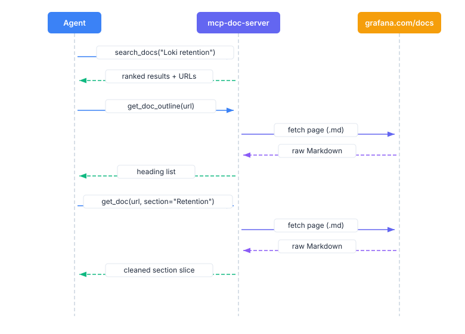

# Tools and CLI reference

Four tools, available as MCP tools and as `docs` CLI commands. JSON output is the same on both surfaces.

| Tool | CLI command | Purpose |
|------|-------------|---------|
| `search_docs` | `docs search` | Find relevant pages by keyword |
| `get_doc_outline` | `docs outline` | Get a page's heading structure |
| `get_doc` | `docs get` | Fetch cleaned Markdown, by section or line range |
| `list_products` | `docs products` | List product documentation groups |

From Go, those map to `Search`, `Outline`, `FetchDoc` plus `Excerpt`, and `Products`. Refer to [Integrate the core library](../integrate/).

## Workflow

Search, outline, then fetch one section:



### Worked example

1. Search for pages:

```json
{"query": "metrics generator", "product": "tempo", "limit": 3}
```

```json
[
  {
    "title": "Metrics-generator",
    "url": "https://grafana.com/docs/tempo/latest/metrics-from-traces/metrics-generator.md",
    "description": "Generate metrics from incoming traces.",
    "product": "Grafana Tempo"
  },
  {
    "title": "Metrics-generator",
    "url": "https://grafana.com/docs/tempo/latest/reference-tempo-architecture/components/metrics-generator.md",
    "description": "The metrics-generator component.",
    "product": "Grafana Tempo"
  }
]
```

2. Outline the top result:

```json
{"url": "https://grafana.com/docs/tempo/latest/metrics-from-traces/metrics-generator/"}
```

```json
{
  "url": "https://grafana.com/docs/tempo/latest/metrics-from-traces/metrics-generator/",
  "headings": [
    {"level": 1, "text": "Metrics-generator", "line": 3},
    {"level": 2, "text": "Architecture", "line": 7},
    {"level": 2, "text": "Native histograms", "line": 53}
  ]
}
```

3. Fetch the section you need:

```json
{
  "url": "https://grafana.com/docs/tempo/latest/metrics-from-traces/metrics-generator/",
  "section": "Native histograms"
}
```

```json
{
  "content": "## Native histograms\n\nNative histograms are a data type in Prometheus...",
  "url": "https://grafana.com/docs/tempo/latest/metrics-from-traces/metrics-generator/",
  "total_lines": 91,
  "returned_range": [53, 60]
}
```

---

## `search_docs`

Returns matching pages ranked by relevance.

### Parameters

| Parameter | Type | Required | Default | Description |
|-----------|------|----------|---------|-------------|
| `query` | string | Yes | None | Search query. Matches whole words in titles and descriptions. |
| `product` | string | No | None | Filter to a specific product. Resolves by exact match, then prefix, then partial match. |
| `limit` | integer | No | 5 | Maximum results to return. |

### Output

A JSON array of `title`, `url`, `description`, and `product`:

```json
[
  {
    "title": "Grafana Alerting",
    "url": "https://grafana.com/docs/grafana/latest/alerting.md",
    "description": "Learn about the Grafana Alerting system and how it works.",
    "product": "Grafana"
  }
]
```

### Ranking

Search ranks matching pages with a term frequency-inverse document frequency (TF-IDF) score. Term frequency rewards a page that contains your query words. Inverse document frequency down-weights words that appear on many pages, so a match on `clustering` scores higher than a match on `grafana`, for example.

- **Word-boundary matching**: tokens match whole words. "rate" matches "rate" but not "migrate".
- **TF-IDF weighting**: uncommon query terms contribute more to the score than common ones.
- **Title 3x weight**: title matches count three times as much as description matches.
- **All-tokens bonus (1.5x)**: when every query token matches and the query has more than one token.
- **Exact phrase bonus (2x)**: when a multi-token query appears verbatim in the title.

### Product filter

The `product` value resolves in this order and stops at the first level that matches:

1. **Exact** (case-insensitive): `Grafana Loki` selects only that product.
2. **Prefix**: `Grafana L` matches "Grafana Loki". Exact match is tried first, so `Grafana` selects the Grafana product only and doesn't add Loki or Mimir.
3. **Partial**: `loki` matches "Grafana Loki".

Use `list_products` to see valid names.

### Empty results

When nothing matches, the tool returns a plain-text message (not a JSON array). It suggests broader terms, or, if you set a product filter, broadening that filter or calling `list_products`.

### Examples

```json
{"query": "traceql query", "product": "tempo"}
{"query": "retention", "product": "Loki"}
{"query": "alerting rules", "limit": 10}
```

---

## `get_doc_outline`

Heading outline of a page. Use it to find section names before calling `get_doc` with a `section`.

### Parameters

| Parameter | Type | Required | Default | Description |
|-----------|------|----------|---------|-------------|
| `url` | string | Yes | None | The `grafana.com/docs/` URL to inspect. |

### Output

```json
{
  "url": "https://grafana.com/docs/grafana/latest/alerting/",
  "headings": [
    {"level": 1, "text": "Grafana Alerting", "line": 3},
    {"level": 2, "text": "Overview", "line": 9},
    {"level": 2, "text": "Explore", "line": 17}
  ]
}
```

Each heading has `level` (1 = `#`, 2 = `##`, …), `text` (formatting stripped), and `line` (1-indexed).

### Parsing rules

Only headings that start with `#`. Also:

- Headings inside fenced code blocks are excluded.
- Lines indented four or more spaces are treated as code, not headings.
- Trailing `#` sequences are stripped (`## Storage ##` becomes `Storage`).
- Headings that are empty after stripping are excluded.

The same `https://grafana.com/docs/` allowlist as `get_doc` applies.

---

## `get_doc`

A page as cleaned Markdown. You can extract a section or page by line range.

### Parameters

| Parameter | Type | Required | Default | Description |
|-----------|------|----------|---------|-------------|
| `url` | string | Yes | None | The `grafana.com/docs/` URL to fetch. Accepts the URL with or without a trailing `.md`, so you can paste a `search_docs` result directly. |
| `section` | string | No | None | Heading text to extract. Returns only that section. |
| `offset` | integer | No | 0 | Line offset for paging (0-indexed). Used when `section` isn't set. |
| `limit` | integer | No | 80 | Maximum lines to return. Used when `section` isn't set. |

### Output

```json
{
  "content": "# Grafana Alerting\n\nMonitor your incoming metrics data or log entries...",
  "url": "https://grafana.com/docs/grafana/latest/alerting/",
  "total_lines": 42,
  "returned_range": [1, 42]
}
```

`content` is the cleaned Markdown, `url` is the source to cite, `total_lines` is the full document length, and `returned_range` is the 1-indexed `[start, end]` of what came back.

### Section extraction

When `section` is set, you get that heading through the next heading of equal or higher level. Matching is case-insensitive. Use `get_doc_outline` first if you need exact names.

### Paging

When `section` isn't set, use `offset` and `limit`. Default `limit` is 80 lines: a short page comes back in full, a long one comes back as a slice unless you raise the limit. Use `total_lines` and `returned_range` to page through.

### Content cleanup

Front matter, Hugo shortcodes, and HTML comments are stripped. Blank lines are collapsed. Code blocks stay intact.

### Errors

If `section` is set but no heading matches, the MCP tool returns:

```
section "Retention" not found. Use get_doc_outline to see available headings.
```

The `docs get` CLI exits with an error that names the missing section.

### Examples

```json
{"url": "https://grafana.com/docs/loki/latest/configure/", "limit": 50}
{"url": "https://grafana.com/docs/grafana/latest/alerting/", "section": "Overview"}
{"url": "https://grafana.com/docs/mimir/latest/configure/configuration-parameters/", "offset": 100, "limit": 50}
```

---

## `list_products`

Product documentation groups and their page counts. Use it to discover names for `search_docs`. No parameters.

### Output

```json
{
  "products": [
    {"name": "Grafana", "count": 745},
    {"name": "Grafana Loki", "count": 188},
    {"name": "Grafana Tempo", "count": 166}
  ]
}
```

Each product has a `name` and a `count` of indexed pages. Counts change as Grafana Labs publishes documentation.

### What counts as a product

Products come from the `## ... documentation` headers in the index. "Documentation home" and "Copyright notice" are excluded. A trailing "documentation" is stripped from each name.

---

## CLI usage

The `docs` CLI is the same tools in a terminal. Useful for testing and scripting without an MCP client.

### Output formats

Every command accepts `-o` / `--output`:

| Format | Description |
|--------|-------------|
| `text` | Aligned tables or raw Markdown (default) |
| `json` | Indented JSON |
| `yaml` | YAML |
| `agents` | Compact single-line JSON |

JSON and YAML keys match the MCP tool output.

### `docs search`

```
docs search <query> [flags]
```

| Flag | Default | Description |
|------|---------|-------------|
| `--product` | None | Filter results to a specific product |
| `--limit` | 5 | Maximum results to return |
| `-o`, `--output` | `text` | Output format |

```bash
docs search "traceql query" --product tempo
docs search "alerting rules" --limit 10
docs search "retention" --product "Grafana Loki"
docs search clustering -o json
```

`search` loads the index on first use.

### `docs get`

```
docs get <url> [flags]
```

| Flag | Default | Description |
|------|---------|-------------|
| `--section` | None | Heading text to extract |
| `--offset` | 0 | Line offset for paging (0-indexed) |
| `--limit` | 80 | Maximum lines to return |
| `-o`, `--output` | `text` | Output format |

```bash
docs get https://grafana.com/docs/tempo/latest/traceql/construct-traceql-queries/ --section "Comparison operators"
docs get https://grafana.com/docs/grafana/latest/alerting/ --section "Overview"
docs get https://grafana.com/docs/tempo/latest/configuration/ --offset 80 --limit 80
```

`get` fetches from `grafana.com` and doesn't need the index.

### `docs outline`

```
docs outline <url> [flags]
```

| Flag | Default | Description |
|------|---------|-------------|
| `-o`, `--output` | `text` | Output format |

```bash
docs outline https://grafana.com/docs/tempo/latest/traceql/construct-traceql-queries/
docs outline https://grafana.com/docs/grafana/latest/alerting/ -o json
```

Same as `get`: no index required.

### `docs products`

```
docs products [flags]
```

| Flag | Default | Description |
|------|---------|-------------|
| `-o`, `--output` | `text` | Output format |

```bash
docs products
docs products -o json
```

`products` loads the index on first use.

### Index loading

Only `search` and `products` load the index. `get` and `outline` fetch pages directly and start immediately. Set `DOCS_INDEX_URL` to override the index location.

### Exit codes

| Code | Meaning |
|------|---------|
| 0 | Success |
| 1 | Error (bad arguments, index load failure, fetch failure, or section not found) |

### Piping

```bash
docs search "alerting" -o agents | jq -r '.[].url'
```

## Related resources

- [Install and connect](../install/)
- [Configure the server](../configure/)
- [Integrate the core library](../integrate/)
