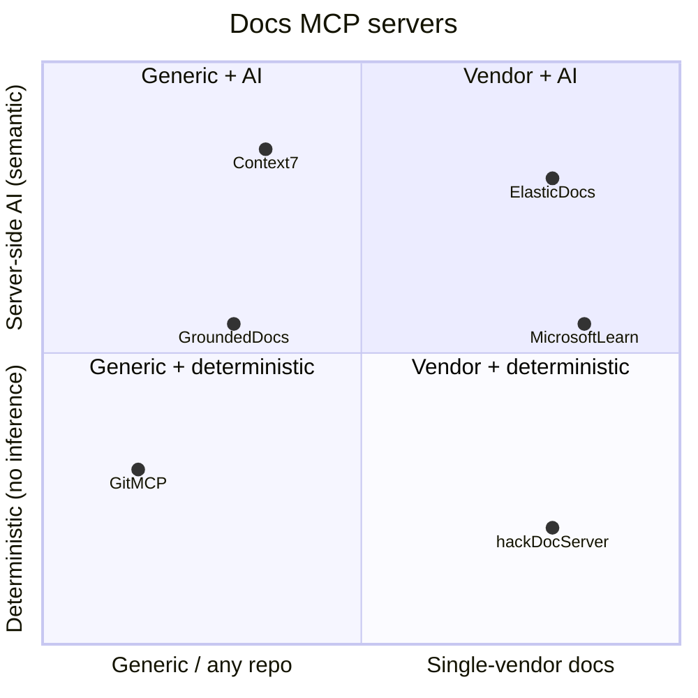

# Docs MCP server ecosystem (survey + lessons)

A survey of the most popular and best-crafted documentation-related MCP servers on
GitHub (as of June 2026), and what each teaches us about `hack-doc-server`'s design.
See `SPECS.md` for the invariants referenced below (I1-I8) and `NOTES.md` for the
decision log.

## The landscape

### Tier 1 — highest adoption

- **Context7** ([upstash/context7](https://github.com/upstash/context7)) — ~57K stars,
  ~950K weekly npm downloads. The de facto docs MCP server. Two tools
  (`resolve-library-id` → `query-docs`); fetches up-to-date, version-specific library
  docs and code examples. Remote HTTP (`https://mcp.context7.com/mcp`) or stdio via npx;
  OAuth + API-key support; topic scoping and pagination (`page=1..10`). Server-side
  parsing/crawling engine is private. TypeScript, MIT.
- **MarkItDown MCP** ([microsoft/markitdown](https://github.com/microsoft/markitdown),
  `packages/markitdown-mcp`) — ~156K stars (parent repo). Single tool
  `convert_to_markdown(uri)` over `http:`/`https:`/`file:`/`data:` URIs. A *converter*,
  not a doc index — complementary to a docs server (turns PDFs/Office/HTML into markdown
  for LLMs). Python, STDIO/Streamable HTTP/SSE, MIT. Note: meant for local/trusted use,
  binds to `localhost`.

### Tier 2 — vendor-backed / well-established

- **Microsoft Learn MCP** ([MicrosoftDocs/mcp](https://github.com/microsoftdocs/mcp)) —
  ~1.7K stars. Closest analog to hack-doc-server: single-vendor docs, no user-visible AI
  in the retrieval surface. Three tools: `microsoft_docs_search` (semantic),
  `microsoft_docs_fetch` (page → markdown), `microsoft_code_sample_search`. Remote HTTP
  (`https://learn.microsoft.com/api/mcp`), built into Visual Studio 2022+. TypeScript.
- **Elastic Docs MCP** (part of
  [elastic/docs-builder](https://github.com/elastic/docs-builder)) — covered in depth in
  [`elastic-docs-mcp.md`](elastic-docs-mcp.md). Hosted Streamable HTTP
  (`https://www.elastic.co/docs/_mcp/`); 6 tools including semantic `search_docs`,
  `find_related_docs`, `analyze_document_structure`, and distinctive coherence/consistency
  tools. AI summaries + relevance scores + navigation context.
- **GitMCP** ([idosal/git-mcp](https://github.com/idosal/git-mcp)) — ~8.2K stars. Turns
  *any* public GitHub repo into a docs hub. URL-as-config (`gitmcp.io/{owner}/{repo}` or
  generic `gitmcp.io/docs`); zero install, no auth. Prioritizes a repo's `llms.txt`,
  falling back to README. Tools: `fetch_documentation`, `search_documentation`,
  `search_code`. TypeScript, Apache-2.0.
- **LangChain mcpdoc** ([langchain-ai/mcpdoc](https://github.com/langchain-ai/mcpdoc)) —
  ~1K stars. Minimal, principled: serves user-defined `llms.txt` files and a single
  `fetch_docs` tool to read URLs within them. Designed for auditability — the user curates
  exactly which doc pages are reachable. Python, STDIO, MIT.

### Tier 3 — strong open-source alternatives

- **Grounded Docs / Docs MCP Server**
  ([arabold/docs-mcp-server](https://github.com/arabold/docs-mcp-server)) — ~1.25K stars.
  Self-hosted, privacy-first ("your code never leaves your network"); explicitly markets
  itself as the open-source alternative to Context7/Nia/Ref.Tools. Indexes websites,
  GitHub, npm, PyPI, and local files; version-specific queries; configurable embedding
  models (OpenAI/Ollama/Gemini); Web UI. TypeScript, MIT, very active (70+ releases).
- **Rust Docs MCP** ([Govcraft/rust-docs-mcp-server](https://github.com/govcraft/rust-docs-mcp-server))
  — ~280 stars. Single-ecosystem example: fetches one crate's docs, embeds them, answers
  via `query_rust_docs` (semantic search + LLM summarization). Rust, MIT.

## Recurring patterns

- **Remote HTTP is the distribution winner.** Elastic, Microsoft Learn, Context7, and
  GitMCP are all URL-as-config — install is one line in `mcp.json`. (hack-doc-server is
  stdio in v1 per `NOTES.md` 3; a hosted HTTP front end is the natural fast-follow over the
  same core.)
- **`llms.txt` is becoming the convention.** GitMCP prioritizes it; mcpdoc is built
  entirely around it. Grafana's `llms-full.txt` is effectively this convention, which puts
  hack-doc-server ahead of the curve (`NOTES.md` 1).
- **Resolve → fetch, two or three steps.** Context7: `resolve-library-id` → `query-docs`.
  hack-doc-server refines this into three: `list_products` / `search_docs` →
  `get_doc_outline` → `get_doc` slice, progressively narrowing before pulling content.
- **Tool-count discipline.** Context7 (2), Microsoft Learn (3), GitMCP (5), Elastic (6).
  hack-doc-server's 4 tools sit in the sweet spot; ecosystem guidance is that >10 tools
  slows agents down.
- **Product / namespace filtering is expected.** Elastic filters by product+section,
  Context7 by library. hack-doc-server's `list_products` + product-scoped `search_docs`
  maps to this (the 26 groups in `llms-full.txt` are the natural filter dimension).
- **Index isolation.** Context7 and GitMCP keep their indexes server-side; only matched
  results reach the model — exactly invariant I1.

## Lessons for hack-doc-server

### Validated decisions

- **Bounded / sliced retrieval (I4, I7) is the main differentiator.** Most servers dump
  whole pages; Elastic offers "optional full body"; Context7 paginates. The
  outline-then-slice workflow is more token-disciplined than any surveyed server — a real
  edge given a single page can be ~35K tokens (`NOTES.md` 5).
- **No server-side inference (I2) is defensible.** Context7, Elastic, Microsoft Learn, and
  the Rust server all use embeddings/AI. But arabold's privacy-first, locally-controlled
  model shows demand for the opposite. Deterministic retrieval is cheaper, faster, and
  reproducible — apt for a known 6,879-entry corpus with titles + descriptions.
- **Citations (I5) are table stakes.** Every serious server returns source URLs.
- **Index isolation (I1) is standard practice**, confirmed by Context7 and GitMCP.

### Worth borrowing (later)

- **A "related docs" tool.** Elastic's `find_related_docs` and Context7's topic scoping
  address "what else exists around this?" hack-doc-server has `list_products` for top-level
  discovery but nothing topic-relative. Not v1-critical, but a validated need.
- **Navigation / parent-page context** in citations (Elastic's
  `analyze_document_structure` returns parent pages) — a cheap enrichment for
  `get_doc_outline` that improves citation quality without server-side inference.
- **A hosted HTTP endpoint** as the v2 distribution story (see patterns above).

### Risks / gaps the survey highlights

- **Search quality without embeddings is the top risk.** Context7's success is largely
  semantic. hack-doc-server's deterministic ranking (still an Open question in `SPECS.md`)
  is the highest-priority design decision for perceived quality. Candidates: TF-IDF over
  title+description, exact-match boosting, product scoping as a pre-filter.
- **Markdown cleanup is underspecified everywhere.** No surveyed server documents its
  cleanup strategy well. I8 ("cleanup preserves meaning") is the right invariant, but the
  exact strip/preserve list is ours to define (MarkItDown is the gold standard for
  *conversion to* markdown, not cleanup of already-markdown docs).

## Positioning

hack-doc-server sits in the **single-vendor, deterministic** quadrant — underserved, with
Microsoft Learn as the closest analog (vendor docs, structured search, no user-visible AI;
~1.7K stars).

Differentiators: bounded slicing (no one else does it well), the outline-then-fetch
workflow, version-aware channel resolution (I6), and the reusable-core architecture
(`NOTES.md` 10) that lets `gcx` and `mcp-grafana` share the retrieval logic.

## Sources

- <https://github.com/upstash/context7>
- <https://github.com/microsoft/markitdown> (`packages/markitdown-mcp`)
- <https://github.com/microsoftdocs/mcp>
- <https://github.com/elastic/docs-builder> (`docs/mcp/index.md`)
- <https://github.com/idosal/git-mcp>
- <https://github.com/langchain-ai/mcpdoc>
- <https://github.com/arabold/docs-mcp-server>
- <https://github.com/govcraft/rust-docs-mcp-server>
